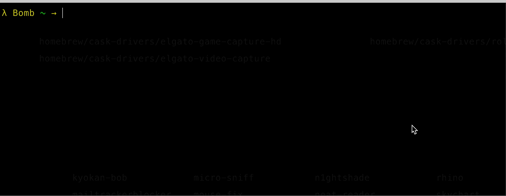
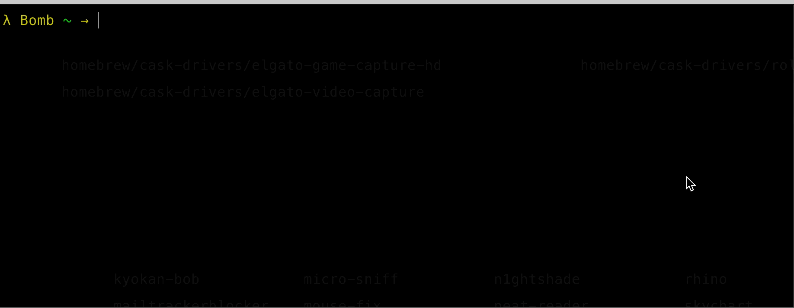

# gonetx/httpit
<p align="center">
  <a href="https://github.com/gonetx/httpit/actions?query=workflow%3ASecurity">
    
  </a>
  <a href="https://github.com/gonetx/httpit/actions?query=workflow%3ATest">
    
  </a>
</p>

`httpit` is a rapid http(s) benchmark tool which on top of [fasthttp](https://github.com/valyala/fasthttp).

## Installation
Just run `go get -u github.com/gonetx/httpit`

## Usage
```bash
Usage:
  httpit url [flags]

Flags:
  -b, --body string         Http request body
      --cert string         Path to the client's TLS Certificate
  -c, --connections int     Maximum number of concurrent connections (default 128)
  -a, --disableKeepAlives   Disable HTTP keep-alive, if true, will set header Connection: close
  -d, --duration duration   Duration of test (default 10s)
  -f, --file string         Read http request body from file path
  -H, --header strings      HTTP request header with format "K: V", can be repeated
  -h, --help                help for httpit
      --host string         Http request host
      --httpProxy string    Http proxy address
  -k, --insecure            Controls whether a client verifies the server's certificate chain and host name
      --key string          Path to the client's TLS Certificate Private Key
  -X, --method string       Http request method (default "GET")
  -p, --pipeline            Use fasthttp pipeline client
  -n, --requests int        Number of requests
      --socksProxy string   Socks proxy address
  -s, --stream              Use stream body to reduce memory usage
  -t, --timeout duration    Socket/request timeout (default 3s)
  -v, --version             version for httpit
```

## Examples
### Use duration
`httpit -X GET "http://httpbin.org/get" -H "accept: application/json" -c2 -d3s`



### Use count
`httpit -X GET "http://httpbin.org/get" -H "accept: application/json" -c2 -n15`


